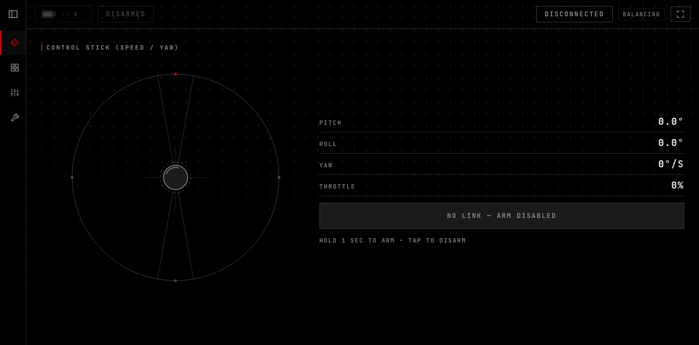
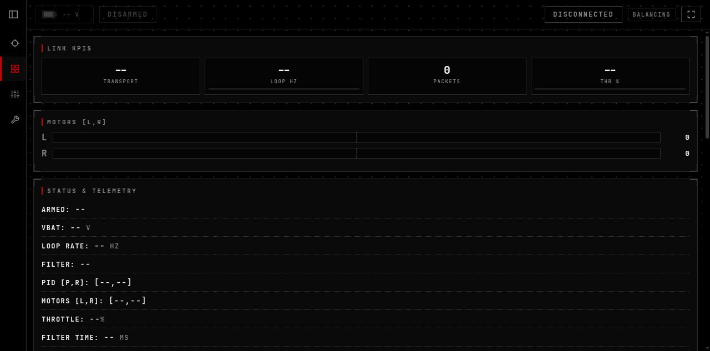
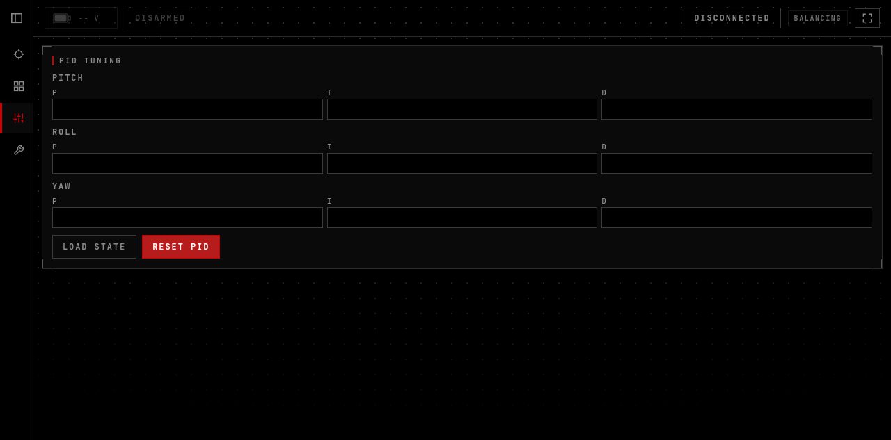
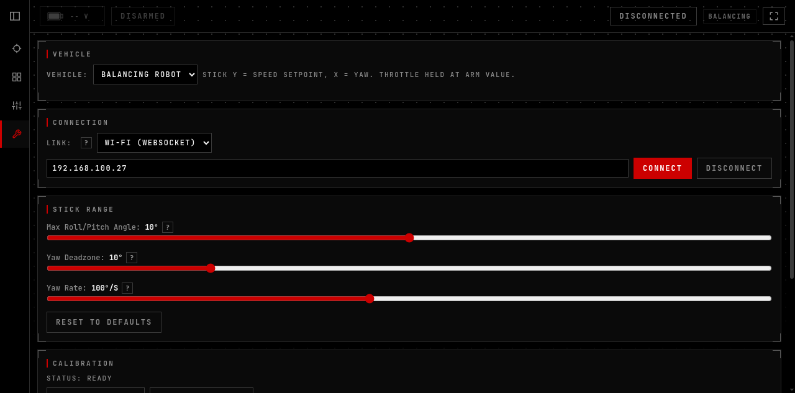

# Balancing Robot

Self-balancing two-wheel robot on ESP32 + L298N + MPU IMU, with a serial
setup wizard, WiFi Web UI (telemetry + PID tuning), and optional ESP-NOW
joystick control. Runtime-configurable: pins, WiFi, IMU, and PID all live
in NVS via the serial CLI — `settings.h` holds seed defaults only.

## Hardware

- Board: ESP32-C3 by default (ESP32 / ESP32-S3 selectable in `settings.h`)
- IMU: auto-detect — MPU6050 (I2C) or MPU6500 (SPI / I2C)
- Drivers: L298N dual H-bridge, N20 motors
- Filter: Madgwick (Kalman, Mahony, EKF, Complementary selectable)
- Control: dual angle PID @ 1 kHz, optional cascade angle+rate mode
- Printable chassis + N20 mounts in `assets/balancing_robot_STL/`

## Setup

1. Open `firmware/balancing_robot/balancing_robot.ino` in Arduino IDE.
   Install ESP32 core plus `WebSocketsServer` (Markus Sattler) and
   `ArduinoOTA` via the Library Manager.
2. In `src/config/settings.h` pick your board (`ACTIVE_BOARD`) and IMU
   (`ACTIVE_IMU`, 0 = auto-detect). Leave `WIFI_SSID` / `WIFI_PASSWORD`
   as placeholders — real credentials go in over serial, never in git.
3. Flash at 115200 baud, then open the Serial Monitor and run `setup`.
   The wizard walks through pins, IMU, motor, LED, link, WiFi, and
   calibration in 7 steps (`setup <step>` jumps straight to one).
4. Set WiFi without touching code: `wifi set ssid <name>`,
   `wifi set pass <password>`, then `wifi save`. Check with `wifi show`
   (passwords stay masked) and `wifi_status`.
5. Connect to the same network and open the robot's IP at port 80 for
   the Web UI (live attitude, battery, arm switch, stick control).
   Telemetry/tuning runs over WebSocket port 81.
6. Tune the balance: start with `DEFAULT_KP_PITCH` / `KI` / `KD` in
   `settings.h`, or live via serial (`pp` / `pi` / `pd` …) or the Web UI —
   every change auto-saves to NVS. `load` reloads saved values,
   `reset_pid` returns to compiled defaults.

Handy serial commands: `status`, `load`, `reset_pid`, `i2c_scan`,
`abort setup`, `reboot`. Type `help` on the robot for the full list.

## Web UI

Dark HUD theme, four tabs. Served by the robot on port 80:

CONTROL — square stick, live pitch/roll/yaw, arm bar:

STATUS — link, battery, IMU, motors:

PID TUNE — pitch/roll/yaw gains, load + reset:

SETUP — vehicle, connection, stick range, calibration:

## Layout

- `firmware/balancing_robot/` — Arduino sketch (`src/config`, `sensors`,
  `filters`, `control`, `comms`, `system`, `utils`; see
  `firmware/ARCHITECTURE.md`)
- `UI/` — Web UI (index.html + css/js), served by the robot on :80
- `assets/balancing_robot_STL/` — chassis + motor mount STLs

## Notes

- `settings.h` in git carries placeholder WiFi/MAC values on purpose.
  Keep it that way — `git add` files explicitly, never `git add -A`.
- Default AP mode: SSID `ESP32_BALANCING`. Change the default AP
  password before taking the robot to public places.
